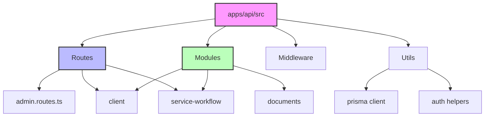

# API Module Structure Diagram

```mermaid
graph TD
    src[apps/api/src]
    src --> routes[Routes]
    src --> modules[Modules]
    src --> middleware[Middleware]
    src --> utils[Utils]
    routes --> admin[admin.routes.ts]
    routes --> client[client.routes.ts]
    routes --> service[service.routes.ts]
    modules --> service[service-workflow]
    modules --> document[documents]
    modules --> client[client]
    utils --> prisma[prisma client]
    utils --> auth[auth helpers]
    style src fill:#f9f,stroke:#333,stroke-width:2px
    style routes fill:#bbf,stroke:#333,stroke-width:2px
    style modules fill:#bfb,stroke:#333,stroke-width:2px
```
