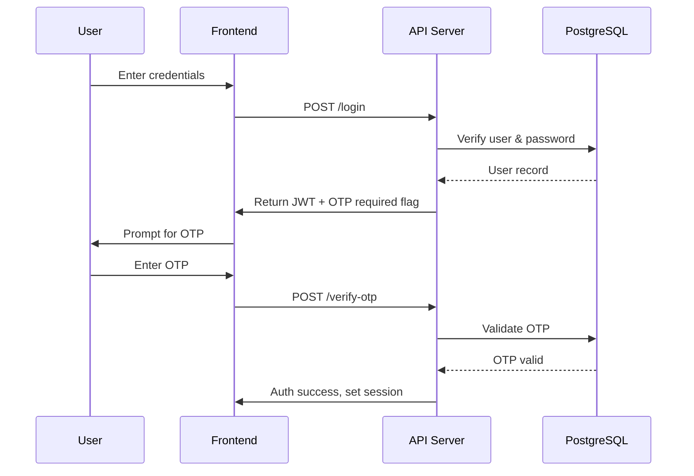

# Authentication Flow Diagram

```mermaid
sequenceDiagram
    participant User
    participant UI as Frontend
    participant API as API Server
    participant DB as PostgreSQL
    User->>UI: Enter credentials
    UI->>API: POST /login
    API->>DB: Verify user & password
    DB-->>API: User record
    API->>UI: Return JWT + OTP required flag
    UI->>User: Prompt for OTP
    User->>UI: Enter OTP
    UI->>API: POST /verify-otp
    API->>DB: Validate OTP
    DB-->>API: OTP valid
    API->>UI: Auth success, set session
```
