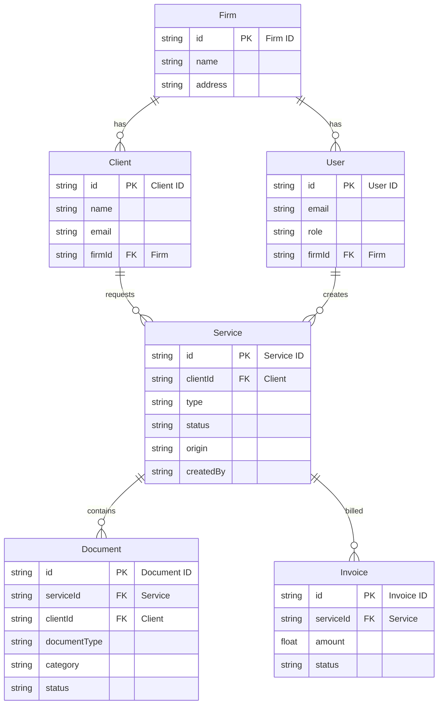

# Database ER Diagram

```mermaid
erDiagram
    Firm {
        string id PK "Firm ID"
        string name
        string address
    }
    User {
        string id PK "User ID"
        string email
        string role
        string firmId FK "Firm"
    }
    Client {
        string id PK "Client ID"
        string name
        string email
        string firmId FK "Firm"
    }
    Service {
        string id PK "Service ID"
        string clientId FK "Client"
        string type
        string status
        string origin
        string createdBy
    }
    Document {
        string id PK "Document ID"
        string serviceId FK "Service"
        string clientId FK "Client"
        string documentType
        string category
        string status
    }
    Invoice {
        string id PK "Invoice ID"
        string serviceId FK "Service"
        float amount
        string status
    }
    Firm ||--o{ User : "has"
    Firm ||--o{ Client : "has"
    Client ||--o{ Service : "requests"
    Service ||--o{ Document : "contains"
    Service ||--o{ Invoice : "billed"
    User ||--o{ Service : "creates"
```
