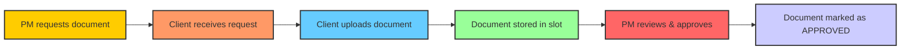

# Document Slot Flow Diagram

```mermaid
graph LR
    A[PM requests document] --> B[Client receives request]
    B --> C[Client uploads document]
    C --> D[Document stored in slot]
    D --> E[PM reviews & approves]
    E --> F[Document marked as APPROVED]
    style A fill:#ffcc00,stroke:#333,stroke-width:2px
    style B fill:#ff9966,stroke:#333,stroke-width:2px
    style C fill:#66ccff,stroke:#333,stroke-width:2px
    style D fill:#99ff99,stroke:#333,stroke-width:2px
    style E fill:#ff6666,stroke:#333,stroke-width:2px
    style F fill:#ccccff,stroke:#333,stroke-width:2px
```
