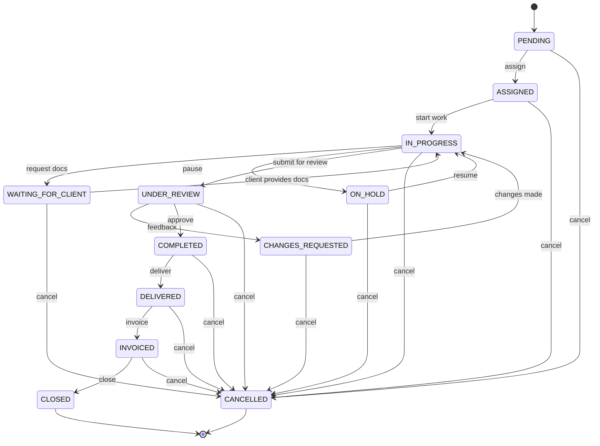

# Service Status Workflow Diagram

```mermaid
stateDiagram-v2
    [*] --> PENDING
    PENDING --> ASSIGNED : assign
    ASSIGNED --> IN_PROGRESS : start work
    IN_PROGRESS --> WAITING_FOR_CLIENT : request docs
    IN_PROGRESS --> ON_HOLD : pause
    IN_PROGRESS --> UNDER_REVIEW : submit for review
    WAITING_FOR_CLIENT --> IN_PROGRESS : client provides docs
    ON_HOLD --> IN_PROGRESS : resume
    UNDER_REVIEW --> CHANGES_REQUESTED : feedback
    UNDER_REVIEW --> COMPLETED : approve
    CHANGES_REQUESTED --> IN_PROGRESS : changes made
    COMPLETED --> DELIVERED : deliver
    DELIVERED --> INVOICED : invoice
    INVOICED --> CLOSED : close
    CLOSED --> [*]
    CANCELLED --> [*]
    PENDING --> CANCELLED : cancel
    ASSIGNED --> CANCELLED : cancel
    IN_PROGRESS --> CANCELLED : cancel
    WAITING_FOR_CLIENT --> CANCELLED : cancel
    ON_HOLD --> CANCELLED : cancel
    UNDER_REVIEW --> CANCELLED : cancel
    CHANGES_REQUESTED --> CANCELLED : cancel
    COMPLETED --> CANCELLED : cancel
    DELIVERED --> CANCELLED : cancel
    INVOICED --> CANCELLED : cancel
```
