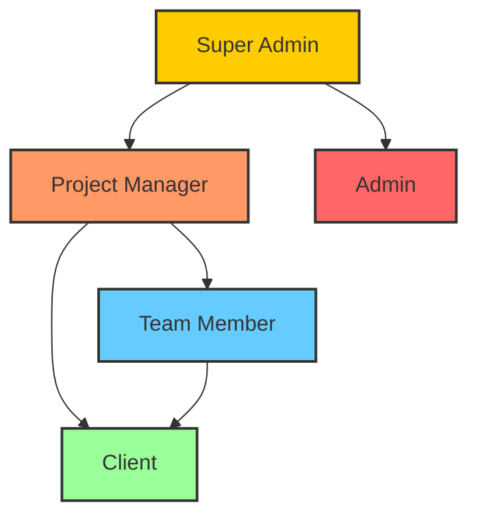

# User Role Hierarchy Diagram

```mermaid
graph TD
    SUPER_ADMIN[Super Admin]
    PROJECT_MANAGER[Project Manager]
    TEAM_MEMBER[Team Member]
    CLIENT[Client]
    ADMIN[Admin]
    SUPER_ADMIN --> PROJECT_MANAGER
    SUPER_ADMIN --> ADMIN
    PROJECT_MANAGER --> TEAM_MEMBER
    PROJECT_MANAGER --> CLIENT
    TEAM_MEMBER --> CLIENT
    style SUPER_ADMIN fill:#ffcc00,stroke:#333,stroke-width:2px
    style PROJECT_MANAGER fill:#ff9966,stroke:#333,stroke-width:2px
    style TEAM_MEMBER fill:#66ccff,stroke:#333,stroke-width:2px
    style CLIENT fill:#99ff99,stroke:#333,stroke-width:2px
    style ADMIN fill:#ff6666,stroke:#333,stroke-width:2px
```
